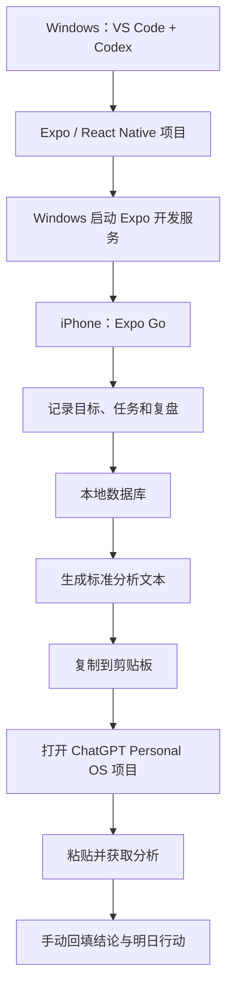
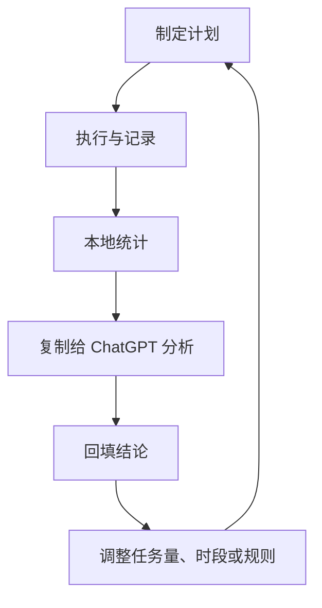

# Personal OS MVP 无 API 方案｜全套文档 V2.0

> 适用场景：仅个人使用；Windows 开发；iPhone 通过 Expo Go 运行；不发布 App Store；不接入 OpenAI API；核心数据保存在手机本地；通过“一键复制 + 跳转 ChatGPT Personal OS 项目”使用 AI 能力。

## 一、统一方案基线

### 1. 产品定位

Personal OS 是一套帮助用户管理目标、计划、执行与复盘的个人管理工具。App 负责结构化记录、任务执行、统计和数据整理；ChatGPT Personal OS 项目负责行为分析、计划建议、复盘反馈和管理陪伴。

### 2. 产品边界

第一阶段包含：

- 今日重点与今日任务
- 任务完成状态与优先级
- 每日状态记录：精力、情绪、专注度
- 每日复盘与未完成原因
- 周目标、周计划与周复盘
- 首页执行看板
- 一键复制今日/本周/项目数据
- 一键打开 ChatGPT Personal OS 项目
- ChatGPT 分析结果手动摘要回填
- 手机本地数据保存与本地导出备份

第一阶段不包含：

- OpenAI API 或其他大模型 API
- App 内嵌 AI 对话
- API Key、服务器和后端代理
- 登录、注册、多用户和云同步
- App Store 发布、支付和订阅
- ChatGPT 自动读取 App 本地数据
- ChatGPT 回复自动写回 App

### 3. 运行流程



### 4. ChatGPT 与 App 的职责

| 模块 | Personal OS App | ChatGPT Personal OS 项目 |
|---|---|---|
| 数据记录 | 负责 | 不自动读取 |
| 任务执行 | 负责 | 提供策略 |
| 完成率统计 | 本地计算 | 解读结果 |
| 执行评分 | 本地按固定公式初算 | 结合原因进行解释 |
| 行为分析 | 保存结构化输入 | 分析拖延、精力和计划问题 |
| 明日计划 | 保存和执行 | 根据复制数据生成建议 |
| 数据传递 | 生成文本并复制 | 用户粘贴后读取 |
| 结果回流 | 用户手动摘要回填 | 不自动写回 |

---

## 二、《Personal OS AI 决策引擎 V2.0》

### 1. 调整原则

AI 决策引擎不再作为 App 内的 API 服务，而是拆分为两部分：

1. App 本地规则引擎：完成确定性计算、校验、排序和数据整理。
2. ChatGPT 决策分析：处理需要理解语境的原因分析、策略生成和自然语言反馈。

### 2. 本地规则引擎

本地完成：

- 按 P0、P1、P2 排序任务
- 标识临近截止日期与逾期任务
- 计算任务完成率、重点任务完成率和计划负荷
- 检查同一时间段的任务冲突
- 根据精力时段提示任务安排：11:00–14:00 优先深度工作，16:00–18:00 安排低负荷任务
- 识别连续延期、连续低分和高负荷日
- 生成供 ChatGPT 使用的结构化文本

### 3. ChatGPT 决策任务

ChatGPT 负责：

- 判断未完成主要属于计划、执行、精力、情绪或外部干扰问题
- 解释用户行为模式
- 提出次日最小改进动作
- 生成日计划与周计划建议
- 识别反复出现的执行障碍
- 给出 Personal OS 规则升级建议

### 4. 决策输出格式

每次分析固定输出：

1. 结论摘要
2. 执行得分解释
3. 主要阻碍
4. 根因判断
5. 明日三项优先行动
6. 需要调整的系统规则

---

## 三、《Personal OS 目标权重模型 V2.0》

### 1. 目标权重维度

| 维度 | 权重 | 说明 |
|---|---:|---|
| 长期价值 | 30% | 对职业、收入、健康或核心人生目标的贡献 |
| 紧迫程度 | 20% | 截止日期和延迟成本 |
| 当前阶段匹配度 | 20% | 是否属于当前阶段必须推进的事项 |
| 可执行性 | 15% | 当前资源、时间和能力是否支持 |
| 复利效应 | 15% | 是否能积累能力、资产或长期习惯 |

### 2. 本地计算

每个维度采用 1–5 分：

`目标权重分 = 长期价值×30% + 紧迫程度×20% + 阶段匹配度×20% + 可执行性×15% + 复利效应×15%`

优先级规则：

- P0：4.2–5.0，当前必须推进
- P1：3.4–4.19，本周重点推进
- P2：2.5–3.39，有余力推进
- 暂缓：低于 2.5

### 3. ChatGPT 参与方式

App 负责算分；当用户不确定评分或目标冲突时，复制目标清单到 ChatGPT，请其提供权重建议，用户确认后手动修改。

---

## 四、《Personal OS 执行评分模型 V2.0》

### 1. 每日基础分

| 指标 | 权重 |
|---|---:|
| P0/P1 重点任务完成率 | 40% |
| 全部计划任务完成率 | 20% |
| 按计划启动情况 | 15% |
| 深度工作完成情况 | 10% |
| 健康与固定习惯完成情况 | 10% |
| 当日复盘完成情况 | 5% |

### 2. 本地计算公式

`每日执行分 = 各项指标得分 × 对应权重之和`

等级：

- 90–100：高质量执行
- 80–89：稳定执行
- 70–79：基本完成，但存在明显损耗
- 60–69：计划或执行系统需要调整
- 低于 60：优先分析根因，不追加任务

### 3. 评分解释

App 显示客观分数；用户一键复制当天数据给 ChatGPT，由 ChatGPT解释“为什么得到这个分数”和“下一步如何改”。情绪和身体不适不作为简单惩罚项，而作为计划合理性分析输入。

---

## 五、《Personal OS 反馈学习引擎 V2.0》

### 1. 反馈闭环



### 2. 本地记录字段

- 计划任务数、完成任务数、重点任务完成数
- 计划开始时间、实际开始时间
- 精力、情绪、专注度
- 未完成原因标签
- 手机干扰、临时事项、身体疲劳等阻碍
- ChatGPT 结论摘要
- 明日改进动作
- 是否采纳建议、采纳后的效果

### 3. 学习规则

- 同类任务连续延期 3 次：提示拆小或删除
- 连续 3 天任务负荷过高：降低次日建议任务量
- 同一时段连续低完成：建议更换任务类型
- 同一阻碍一周出现 3 次：列为周复盘重点
- ChatGPT 建议连续两次无效：标记为不适用策略

---

## 六、《Personal OS MVP 产品范围定义 V2.0》

### 1. MVP 核心目标

用最小功能验证三个问题：

1. 用户是否愿意每天在手机记录任务和状态。
2. 结构化数据是否能提高 ChatGPT 分析质量。
3. “复制—跳转—粘贴—回填”的操作成本是否可接受。

### 2. MVP 页面

| 页面 | 核心功能 |
|---|---|
| 今日 | 今日重点、任务、状态、快速记录 |
| 计划 | 周目标、任务排期、优先级 |
| 复盘 | 每日复盘、周复盘、执行评分 |
| 我的 | Personal OS 规则、ChatGPT 项目链接、数据备份 |

### 3. MVP 必须功能

- 任务增删改查、优先级、截止时间和完成状态
- 今日重点设置
- 精力、情绪和专注度记录
- 未完成原因选择与补充说明
- 每日执行分自动计算
- 今日数据一键复制
- 本周数据一键复制
- 打开 ChatGPT Personal OS 项目
- ChatGPT 分析摘要手动回填
- 本地持久化保存
- JSON 数据导出与恢复

### 4. 暂缓功能

- 项目全生命周期管理
- 健康、财务和知识库完整模块
- 自动通知和复杂统计图表
- 多设备同步
- AI 自动调用与自动回写

---

## 七、《Personal OS MVP iOS 页面原型设计 V2.0》

> 技术实现已从原生 SwiftUI 改为 React Native 页面，但用户仍在 iPhone 上使用。

### 1. 今日页

- 顶部：日期、问候语、今日执行分
- 今日重点卡：最多 1–3 项
- 今日任务列表：勾选、优先级、预计时长
- 今日状态：精力、情绪、专注度 1–10 分
- 快速记录：阻碍、想法、临时任务
- 底部按钮：复制今日数据、打开 ChatGPT

### 2. 计划页

- 本周目标
- 目标权重与 P0/P1/P2 标识
- 每日任务安排
- 未排期任务箱
- 任务负荷提示

### 3. 复盘页

- 今日完成率与执行分
- 未完成任务和原因
- 今日做得最好的一件事
- 今日最大阻碍
- ChatGPT 分析摘要
- 明日改进动作
- 复制本周数据入口

### 4. 我的页

- Personal OS 基本规则
- ChatGPT Personal OS 项目链接配置
- 复制模板管理
- 本地数据导出/恢复
- 使用说明与隐私说明

---

## 八、《Personal OS ChatGPT Prompt 系统设计 V2.0》

> 原“App 内 AI Prompt 系统”改为“ChatGPT 项目使用的复制模板与分析指令系统”。

### 1. 今日复盘模板

```text
【Personal OS｜今日执行数据】
日期：{{date}}
今日重点：{{focus}}
任务清单：{{tasks}}
完成率：{{completionRate}}
执行分：{{executionScore}}
精力：{{energy}}/10
情绪：{{mood}}/10
专注度：{{focusLevel}}/10
未完成原因：{{reasons}}
补充记录：{{notes}}

请按照 Personal OS 执行分析规则输出：
1. 今日执行结论
2. 得分解释
3. 未完成的主要根因
4. 计划、精力、情绪、执行或外部干扰的分类判断
5. 明日最重要的三项行动
6. 一条需要调整的 Personal OS 规则
```

### 2. 周复盘模板

```text
【Personal OS｜本周执行数据】
本周目标：{{weeklyGoals}}
每日执行分：{{dailyScores}}
重点任务完成情况：{{priorityTasks}}
运动、英语及项目推进：{{routinesAndProjects}}
未完成事项：{{unfinished}}
高频阻碍：{{obstacles}}
本周总结：{{weeklyNotes}}

请输出：
1. 本周综合评分与依据
2. 做得最好的三件事
3. 最主要的执行损耗
4. 反复出现的行为模式
5. 下周 P0/P1 建议
6. 下周任务量和节奏调整
```

### 3. 明日计划模板

```text
请基于以上执行数据生成明日计划。要求：
1. 时间轴为 10:00–22:00；
2. 11:00–14:00 优先安排深度工作；
3. 16:00–18:00 安排低负荷任务；
4. 保留午饭、晚饭和恢复时间；
5. P0 不超过 2 项；
6. 明确每项任务的开始时间、完成标准和最小启动动作。
```

### 4. 结果回填

App 不解析 ChatGPT 回复。用户只回填：

- 今日核心结论
- 根因分类
- 明日三项行动
- 规则调整建议

---

## 九、《Personal OS MVP 数据库设计 + 技术架构 V2.0》

### 1. 技术栈

| 层级 | 方案 |
|---|---|
| 开发系统 | Windows |
| 编辑器 | 中文版 VS Code + Codex |
| App 框架 | React Native + Expo |
| 语言 | TypeScript |
| 导航 | Expo Router |
| 状态管理 | React Context 或 Zustand（二选一，MVP 优先简单方案） |
| 本地数据库 | Expo SQLite |
| 少量设置 | AsyncStorage |
| 剪贴板 | expo-clipboard |
| 外部跳转 | React Native Linking |
| 手机运行 | iPhone + Expo Go |
| 代码管理 | Git + GitHub |

### 2. 数据表

#### goals

- id
- title
- description
- status
- deadline
- long_term_value
- urgency
- stage_fit
- feasibility
- compounding
- weight_score
- priority
- created_at
- updated_at

#### tasks

- id
- goal_id
- title
- date
- priority
- estimated_minutes
- planned_start_time
- actual_start_time
- completed
- completed_at
- postponed_count
- created_at
- updated_at

#### daily_logs

- id
- date
- focus_text
- energy
- mood
- concentration
- obstacle_tags
- notes
- execution_score
- created_at
- updated_at

#### reviews

- id
- type（daily/weekly）
- start_date
- end_date
- summary
- root_cause
- chatgpt_summary
- next_actions
- rule_adjustment
- created_at

#### settings

- key
- value
- updated_at

### 3. 数据安全与备份

- 数据默认只存手机本地
- 不采集通讯录、照片、密码等无关数据
- 复制前显示将要复制的文本
- 支持导出 JSON 备份
- 支持从用户选择的 JSON 文件恢复
- GitHub 只保存代码，不保存真实个人数据

---

## 十、《Personal OS MVP Codex 开发实施方案 V2.0》

### 1. 开发阶段

| 阶段 | 目标 | 交付结果 |
|---|---|---|
| Day 1 | 环境与工程 | Windows 创建 Expo 项目，iPhone Expo Go 跑通，4 个 Tab |
| Day 2 | 今日任务 | 今日重点、任务列表、增删改、完成切换 |
| Day 3 | 本地存储 | Expo SQLite 建表并持久化任务与日志 |
| Day 4 | 状态与复盘 | 精力、情绪、专注度、未完成原因、每日评分 |
| Day 5 | ChatGPT 快捷助手 | 生成今日文本、复制剪贴板、跳转 ChatGPT 项目 |
| Day 6 | 周计划与周复盘 | 周目标、周统计、复制本周数据 |
| Day 7 | 备份与验收 | JSON 导出/恢复、错误处理、完整验收 |

### 2. 每日开发规则

- 每天只实现当天范围
- Codex 修改前先检查现有代码
- 不引入 API、服务器、登录或云同步
- 每个功能必须在 iPhone Expo Go 中验收
- 每天结束执行 Git commit
- 出错时进行最小范围修复，不重建整个项目

### 3. 关键验收标准

- Windows 能启动 Expo 开发服务
- iPhone 能通过 Expo Go 打开项目
- 关闭并重新打开后，本地数据仍存在
- 今日任务可以增删改和完成
- 执行分计算正确
- 复制内容与页面数据一致
- 点击按钮能打开 ChatGPT
- 无网络时，除 ChatGPT 跳转外的核心功能可使用

---

## 十一、《Personal OS MVP Codex 首轮开发 Prompt 合集 V2.0》

### Prompt 1：检查环境与项目

```text
你是 Personal OS MVP 的 React Native 开发工程师。
请检查当前项目，不要立即修改文件。

固定条件：
1. 开发电脑为 Windows；
2. 使用 Expo、React Native、TypeScript；
3. 在 iPhone 的 Expo Go 中运行；
4. 仅个人使用，不发布 App Store；
5. 数据优先保存在手机本地；
6. 不使用任何大模型 API；
7. 不开发服务器、登录、支付和云同步；
8. AI 分析采用“生成文本—复制—打开 ChatGPT—用户粘贴”的流程。

请输出项目结构、当前可运行性、缺失依赖、最小修改范围和验收方法。
```

### Prompt 2：Day 1 工程骨架

```text
请执行 Personal OS MVP Day 1。
仅完成：
1. Expo Router 基础结构；
2. 今日、计划、复盘、我的 4 个底部导航；
3. 今日页静态卡片和本地模拟任务；
4. 点击任务切换完成状态；
5. 简体中文界面；
6. iPhone Expo Go 可运行。

不要接入数据库、API、服务器、登录、动画和第三方 UI 框架。
先列出拟修改文件，再修改、检查 TypeScript 错误，最后给出 Windows 中文版软件的验收步骤。
```

### Prompt 3：本地数据库

```text
请在现有 Expo 项目中使用 Expo SQLite 实现本地持久化。
保存 goals、tasks、daily_logs、reviews 和 settings。
不得增加网络请求、后端服务或 API Key。
提供数据库初始化、增删改查、错误处理和迁移版本号。
修改后验证 App 重启数据仍存在。
```

### Prompt 4：ChatGPT 快捷助手

```text
请实现“ChatGPT 快捷助手”，但不得调用任何 AI API。

功能：
1. 从本地读取今日重点、任务、执行分、精力、情绪、专注度、未完成原因和补充记录；
2. 按既定模板生成可预览的纯文本；
3. 用户确认后复制到手机剪贴板；
4. 显示复制成功提示；
5. 提供“打开 ChatGPT”按钮，使用用户在设置页保存的链接；
6. 链接为空或打开失败时给出中文提示；
7. 不自动发送数据，不读取 ChatGPT 回复，不自动回写结果。

请保持改动最小并列出真机验收步骤。
```

### Prompt 5：最终范围检查

```text
请检查 Personal OS MVP 是否符合无 API 方案。

必须删除或禁用：
- OpenAI SDK 和所有大模型 SDK；
- API Key、环境变量中的模型密钥；
- AI 网络请求、后端代理和服务器代码；
- 登录、云同步、支付和 App Store 发布相关功能；
- Swift、SwiftUI、Xcode 和 Core Data 相关旧代码或文档。

必须保留：
- Windows + Expo + React Native + TypeScript；
- iPhone Expo Go 运行；
- 本地数据；
- 一键生成并复制标准文本；
- 打开 ChatGPT Personal OS 项目；
- 用户手动粘贴和回填结论。

先输出检查结果，再进行最小修复，最后给出验收清单。
```

---

## 十二、旧文档统一替换规则

| 旧内容 | V2.0 统一替换 |
|---|---|
| Swift / SwiftUI | TypeScript / React Native |
| Xcode / macOS | 中文版 VS Code / Windows |
| iPhone 模拟器 | iPhone 真机 + Expo Go |
| Core Data / SwiftData | Expo SQLite + AsyncStorage |
| App 内 AI Coach API | ChatGPT 快捷助手 |
| OpenAI API | 一键复制标准文本 + 跳转 ChatGPT |
| API Key / 云端代理 | 全部删除 |
| AI 自动分析 | 用户粘贴后由 ChatGPT 分析 |
| AI 自动回写 | 用户手动回填摘要与行动 |
| App Store 发布 | 不纳入项目范围 |
| 多用户账号 | 仅单人本地使用 |

## 十三、V2.0 最终产品流程

1. 用户在 Personal OS App 中制定目标和今日任务。
2. App 在手机本地保存数据并计算完成率、权重和执行分。
3. 用户完成任务，记录精力、情绪、专注度和阻碍。
4. App 自动生成“今日执行数据”预览文本。
5. 用户点击复制，再点击“打开 ChatGPT”。
6. 用户进入 ChatGPT Personal OS 项目，粘贴并发送。
7. ChatGPT 按 Personal OS 规则分析根因并生成明日建议。
8. 用户将核心结论、明日三项行动和规则调整摘要回填 App。
9. 周末 App 汇总本周数据，重复复制与周复盘流程。
10. 根据复盘结果调整下周目标、任务量和执行规则。

## 十四、版本结论

从 V2.0 起，Personal OS 的正式技术与产品基线为：

> Windows 开发 + Expo/React Native/TypeScript + iPhone Expo Go 运行 + 手机本地数据 + 本地规则计算 + 一键复制结构化数据 + 跳转 ChatGPT Personal OS 项目 + 用户手动回填分析结论。

后续任何产品、原型、数据库、开发计划和 Codex Prompt 均以此基线为准，不再出现 OpenAI API、SwiftUI、Xcode、App Store 发布或自动 AI 回写方案。
