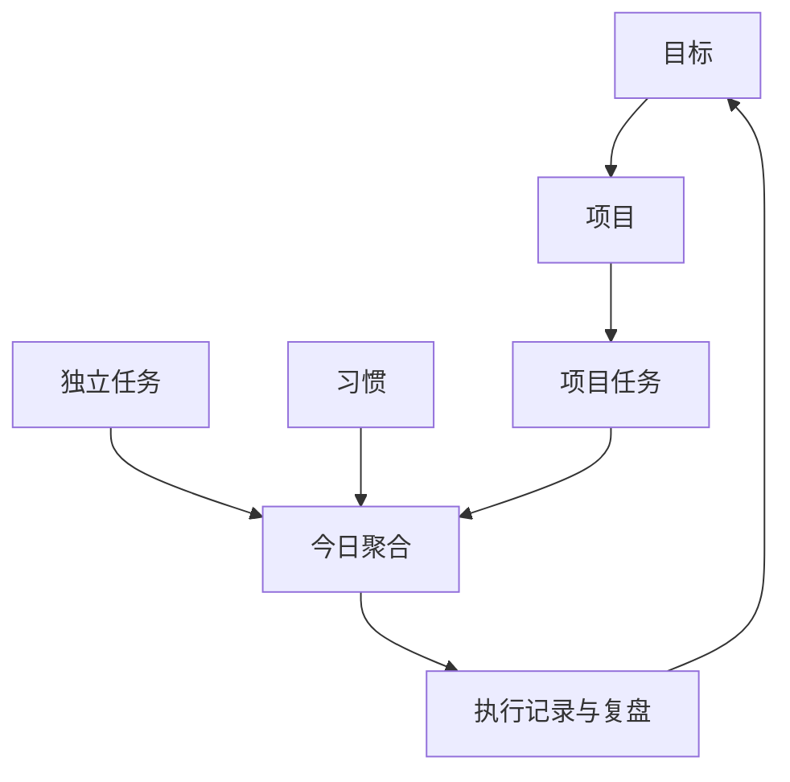
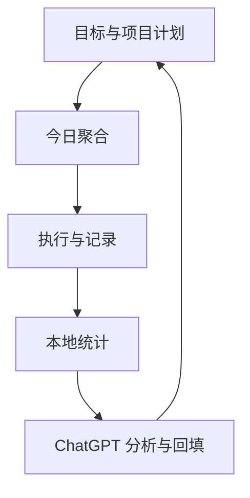
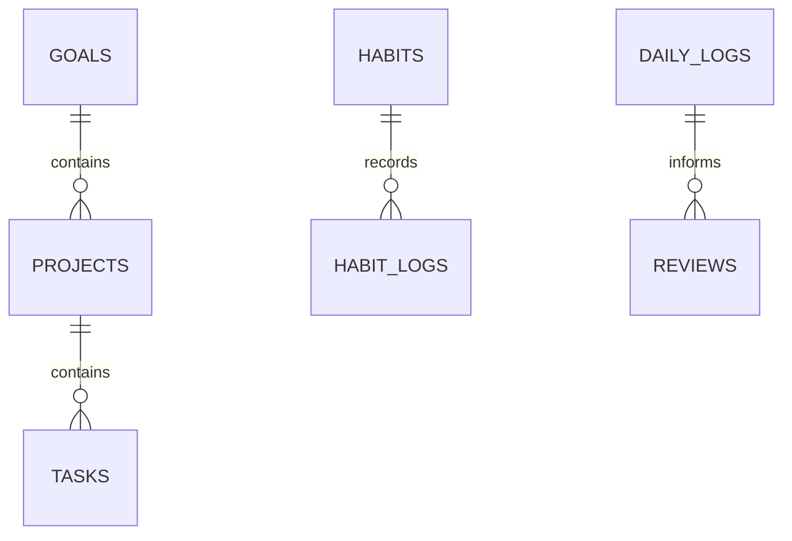

> 适用场景：仅个人使用；Windows 开发；iPhone 通过 Expo Go 运行；不发布 App Store；基础 MVP 阶段不接入大模型 API；核心数据保存在手机本地；通过“一键复制 + 跳转 ChatGPT Personal OS 项目”使用 AI 能力。基础闭环稳定后，可评估通过安全后端接入 DeepSeek 或 OpenAI API。

## 一、统一方案基线

### 1. 产品定位

Personal OS 是一套帮助用户连接长期目标、阶段项目、日常任务、习惯执行与复盘反馈的个人管理工具。

统一管理原则：

> 内容按“目标—项目—任务＋习惯”组织，操作按“今日—计划—复盘—我的”展示。

App 负责结构化记录、执行、统计和数据整理；ChatGPT Personal OS 项目负责行为分析、计划建议、复盘反馈和管理陪伴。

### 2. 管理对象

| 对象 | 定义 | 示例 |
|---|---|---|
| 目标 | 一段时间内希望达到的方向或结果 | 掌握 AI 开发、改善体脂与体态 |
| 项目 | 有明确结果、阶段和结束条件的事项 | Personal OS MVP、新疆旅行筹备 |
| 项目任务 | 为推进某个项目而执行的一次性行动 | 完成任务持久化、预订酒店 |
| 独立任务 | 暂时不属于项目的一次性事项 | 浇花、购买生活用品 |
| 习惯 | 长期重复、按频率执行的事项 | 英语 1 小时、体态训练、力量训练 |
| 执行记录 | 某日任务与习惯的实际完成情况 | 完成、延期、跳过、未完成原因 |
| 复盘 | 对执行结果、项目推进和行为模式的分析 | 日复盘、周复盘、项目复盘 |

### 3. 产品边界

基础 MVP 包含：

- 项目创建、编辑、状态和轻量进度管理
- 任务增删改查、优先级、日期、预计时长和项目关联
- 独立任务，以及每日/每周习惯
- 今日聚合项目任务、独立任务和当天习惯
- 任务与习惯完成记录的本地持久化
- 每日状态记录：精力、情绪、专注度
- 每日复盘、周复盘与未完成原因
- 项目推进、习惯完成和执行评分的基础统计
- 一键复制今日、本周和项目数据
- 一键打开 ChatGPT Personal OS 项目
- ChatGPT 分析结果手动摘要回填
- 手机本地数据保存与本地导出备份

基础 MVP 不包含：

- 完整项目生命周期、甘特图、看板和多人协作
- App 内嵌 AI 对话或自动调用大模型
- API Key 直接保存在 App
- 登录、注册、多用户和云同步
- App Store 发布、支付和订阅
- ChatGPT 自动读取 App 本地数据或自动写回
- 健康、财务、知识库等完整垂直模块

### 4. 信息流



### 5. App 与 ChatGPT 的职责

| 模块 | Personal OS App | ChatGPT Personal OS 项目 |
|---|---|---|
| 数据记录 | 负责 | 不自动读取 |
| 项目与任务执行 | 负责 | 提供策略和拆解建议 |
| 习惯打卡 | 负责 | 分析持续性和中断原因 |
| 本地统计 | 负责计算 | 解读结果 |
| 行为分析 | 保存结构化输入 | 分析拖延、精力和计划问题 |
| 数据传递 | 生成文本并复制 | 用户粘贴后读取 |
| 结果回流 | 用户手动摘要回填 | 不自动写回 |

---

## 二、《Personal OS AI 决策引擎 V2.1》

### 1. 组成

1. App 本地规则引擎：完成确定性计算、排序、校验和提示。
2. ChatGPT 决策分析：处理需要理解语境的原因分析、策略生成和自然语言反馈。
3. 未来 API 服务层：基础 MVP 稳定后再评估，不影响当前开发。

### 2. 本地规则引擎

- 按目标权重、项目优先级和任务 P0/P1/P2 排序
- 标识临近截止日期与逾期任务
- 聚合当天项目任务、独立任务和习惯
- 计算任务完成率、重点任务完成率和习惯完成率
- 计算项目任务完成进度并提示长期未推进项目
- 检查时间冲突和计划负荷
- 11:00–14:00 优先安排深度工作，16:00–18:00 提示低负荷任务
- 识别连续延期、习惯中断、连续低分和跨项目投入失衡
- 生成供 ChatGPT 使用的结构化文本

### 3. ChatGPT 决策任务

- 判断未完成属于计划、执行、精力、情绪或外部干扰问题
- 分析项目停滞原因和项目间资源分配
- 识别低价值任务挤占高优先级项目的情况
- 分析习惯中断是目标不合理、环境阻碍还是恢复不足
- 提出次日最小改进动作和项目推进动作
- 生成日计划、周计划和周复盘建议
- 给出 Personal OS 规则升级建议

### 4. 固定输出

1. 结论摘要
2. 执行得分解释
3. 项目推进判断
4. 习惯执行判断
5. 主要阻碍与根因
6. 明日三项优先行动
7. 需要调整的系统规则

---

## 三、《Personal OS 目标权重模型 V2.1》

### 1. 目标权重

| 维度 | 权重 | 说明 |
|---|---:|---|
| 长期价值 | 30% | 对职业、收入、健康或核心人生目标的贡献 |
| 紧迫程度 | 20% | 截止日期和延迟成本 |
| 当前阶段匹配度 | 20% | 是否属于当前阶段必须推进的事项 |
| 可执行性 | 15% | 当前资源、时间和能力是否支持 |
| 复利效应 | 15% | 是否能积累能力、资产或长期习惯 |

`目标权重分 = 长期价值×30% + 紧迫程度×20% + 阶段匹配度×20% + 可执行性×15% + 复利效应×15%`

- P0：4.2–5.0，当前必须推进
- P1：3.4–4.19，本周重点推进
- P2：2.5–3.39，有余力推进
- 暂缓：低于 2.5

### 2. 权重传递

- 目标权重决定其下项目的基础优先级。
- 项目可因截止日期、依赖关系和阶段状态进行局部调整。
- 任务优先级综合项目优先级、任务紧迫性和当日可执行性确定。
- 习惯不直接继承项目优先级；通过关联目标和频率管理。
- 独立任务按紧迫性和影响单独判断，避免临时事项长期挤占 P0 项目。

### 3. MVP 实现范围

基础 MVP 保存目标与项目关联，但暂不制作复杂权重配置页面。先支持手动 P0/P1/P2；计算模型作为后续优化能力保留。

---

## 四、《Personal OS 执行评分模型 V2.1》

### 1. 每日执行分

| 指标 | 权重 |
|---|---:|
| P0/P1 重点任务完成率 | 35% |
| 全部计划任务完成率 | 20% |
| 按计划启动情况 | 15% |
| 深度工作完成情况 | 10% |
| 当日习惯完成情况 | 10% |
| 当日复盘完成情况 | 10% |

`每日执行分 = 各项指标得分 × 对应权重之和`

- 90–100：高质量执行
- 80–89：稳定执行
- 70–79：基本完成，但存在明显损耗
- 60–69：计划或执行系统需要调整
- 低于 60：优先分析根因，不追加任务

### 2. 分开统计原则

- 项目任务、独立任务和习惯分别统计，再汇总每日执行分。
- 项目进度是阶段性结果，不直接等同于每日完成率。
- 习惯按当天是否应执行计算，休息日不计为未完成。
- 身体不适和经期等情况作为计划合理性输入，不做简单惩罚。
- 延期但已重新安排的任务仍保留延期记录，便于行为分析。

### 3. 项目推进指标

- 项目任务完成数 / 项目有效任务总数
- 本周实际推进次数
- 距离最近一次推进的天数
- 逾期任务数
- 是否存在“完成大量低优先级任务但核心项目无推进”

---

## 五、《Personal OS 反馈学习引擎 V2.1》

### 1. 反馈闭环



### 2. 本地记录字段

- 项目、本周项目推进次数和最近推进日期
- 计划任务数、完成任务数、重点任务完成数
- 计划开始时间、实际开始时间
- 当日应执行习惯数和完成数
- 精力、情绪、专注度
- 未完成原因标签和补充说明
- 手机干扰、临时事项、身体疲劳等阻碍
- ChatGPT 结论摘要、明日改进动作及采纳效果

### 3. 学习规则

- 同类任务连续延期 3 次：提示拆小、重排或删除
- 活跃项目连续 7 天无推进：标记为停滞并要求确认下一步
- P0 项目一周无推进：进入周复盘重点
- 同一项目逾期任务达到 3 项：提示降低范围或重新排期
- 习惯连续中断 3 次：检查频率、时段和最小执行标准
- 连续 3 天任务负荷过高：降低次日建议任务量
- 同一时段连续低完成：建议更换任务类型
- 同一阻碍一周出现 3 次：列为周复盘重点
- ChatGPT 建议连续两次无效：标记为不适用策略

---

## 六、《Personal OS MVP 产品范围定义 V2.1》

### 1. MVP 核心目标

验证四个问题：

1. 用户是否愿意每天在手机记录并完成任务与习惯。
2. 项目关联是否能帮助识别高价值事项的真实推进情况。
3. 结构化数据是否能提高 ChatGPT 分析质量。
4. “复制—跳转—粘贴—回填”的操作成本是否可接受。

### 2. 四个页面

| 页面 | 核心职责 |
|---|---|
| 今日 | 聚合当天项目任务、独立任务和习惯，记录状态和快速事项 |
| 计划 | 管理项目、任务、习惯和未来排期 |
| 复盘 | 查看任务、习惯、项目推进、执行评分和未完成原因 |
| 我的 | Personal OS 规则、ChatGPT 链接、数据备份及未来 AI 设置 |

### 3. MVP 必须功能

- Project、Task、Habit 三类核心数据
- 项目创建、编辑、状态、优先级和简单进度
- 任务增删改查、日期、优先级、预计时长和可选 projectId
- 临时任务允许不属于任何项目
- 每日/每周习惯及完成记录
- 今日统一聚合和完成切换
- 项目标签、任务类型和习惯类型的基本视觉区分
- 精力、情绪、专注度和未完成原因记录
- 每日执行分与项目推进基础统计
- 今日、本周和项目数据一键复制
- 打开 ChatGPT Personal OS 项目并手动回填摘要
- 本地持久化、JSON 导出与恢复

### 4. 暂缓功能

- 人生领域与年度目标的完整管理页面
- 项目看板、甘特图、依赖关系和里程碑体系
- 完整项目生命周期、多人协作和权限
- 自动通知和复杂统计图表
- 多设备同步
- AI 自动调用与自动回写

---

## 七、《Personal OS MVP iOS 页面原型设计 V2.1》

> 技术实现为 React Native + Expo Router，用户在 iPhone 的 Expo Go 中使用。

### 1. 今日页

- 顶部：日期、问候语、今日执行分
- 今日重点卡：最多 1–3 项
- 今日任务：显示优先级、项目标签、预计时长和完成状态
- 今日习惯：仅显示当天应执行的习惯
- 快速记录：阻碍、想法和临时任务
- 今日状态：精力、情绪、专注度 1–10 分
- 底部：复制今日数据、打开 ChatGPT

### 2. 计划页

- 项目列表：进行中、暂停、已完成
- 项目卡片：名称、优先级、截止日期、简单进度和下一步
- 任务列表：项目任务、独立任务、未排期任务
- 新建/编辑任务时可选择所属项目
- 习惯列表：频率、目标次数和启用状态
- 本周计划与任务负荷提示

### 3. 复盘页

- 今日完成率与执行分
- 项目任务、独立任务和习惯分项统计
- 本周各项目推进情况与停滞提醒
- 未完成任务、原因和延期次数
- 今日最好的一件事、最大阻碍
- ChatGPT 分析摘要与明日改进动作
- 复制本周数据入口

### 4. 我的页

- Personal OS 基本规则和精力时段
- ChatGPT Personal OS 项目链接配置
- 复制模板管理
- 本地数据导出/恢复
- 未来 AI 模型与服务设置占位（基础 MVP 不启用）
- 使用说明与隐私说明

---

## 八、《Personal OS ChatGPT Prompt 系统设计 V2.1》

### 1. 今日复盘模板

```text
【Personal OS｜今日执行数据】
日期：{{date}}
今日重点：{{focus}}
项目任务：{{projectTasks}}
独立任务：{{standaloneTasks}}
今日习惯：{{habits}}
任务完成率：{{taskCompletionRate}}
习惯完成率：{{habitCompletionRate}}
执行分：{{executionScore}}
精力：{{energy}}/10
情绪：{{mood}}/10
专注度：{{focusLevel}}/10
未完成原因：{{reasons}}
补充记录：{{notes}}

请输出：
1. 今日执行结论与得分解释
2. 核心项目是否获得有效推进
3. 未完成的主要根因分类
4. 习惯中断或完成的关键因素
5. 明日最重要的三项行动
6. 一条需要调整的 Personal OS 规则
```

### 2. 周复盘模板

```text
【Personal OS｜本周执行数据】
本周目标：{{weeklyGoals}}
项目推进：{{projectProgress}}
停滞或逾期项目：{{stalledProjects}}
每日执行分：{{dailyScores}}
重点任务完成情况：{{priorityTasks}}
习惯完成情况：{{habitSummary}}
未完成事项：{{unfinished}}
高频阻碍：{{obstacles}}
本周总结：{{weeklyNotes}}

请输出：
1. 本周综合评分与依据
2. 做得最好的三件事
3. 各项目投入是否匹配优先级
4. 最主要的执行损耗与行为模式
5. 下周 P0/P1 项目和任务建议
6. 下周任务量、习惯频率和节奏调整
```

### 3. 项目诊断模板

```text
【Personal OS｜项目诊断】
项目：{{project}}
目标：{{goal}}
截止日期：{{deadline}}
当前进度：{{progress}}
已完成任务：{{completedTasks}}
未完成与延期任务：{{unfinishedTasks}}
最近一次推进：{{lastProgressAt}}
主要阻碍：{{obstacles}}

请判断项目是否停滞，说明根因，并输出：
1. 当前最小可交付结果
2. 下一步可在 30 分钟内启动的动作
3. 应删除、延后或拆分的任务
4. 未来 7 天的推进建议
```

### 4. 明日计划约束

- 时间轴为 10:00–22:00
- 11:00–14:00 优先安排深度工作
- 16:00–18:00 安排低负荷任务
- 保留午饭、晚饭和恢复时间
- P0 不超过 2 项
- 每项任务包含开始时间、完成标准和最小启动动作
- 同一天避免安排过多项目切换

### 5. 结果回填

App 不解析 ChatGPT 回复。用户仅回填核心结论、根因分类、明日三项行动和规则调整建议。

---

## 九、《Personal OS MVP 数据库设计 + 技术架构 V2.1》

### 1. 技术栈

| 层级 | 方案 |
|---|---|
| 开发系统 | Windows |
| 编辑器 | 中文版 VS Code + Codex |
| App 框架 | React Native + Expo |
| 语言 | TypeScript |
| 导航 | Expo Router |
| 状态管理 | React Context 或 Zustand，MVP 优先简单方案 |
| 本地数据库 | Expo SQLite |
| 少量设置 | AsyncStorage |
| 剪贴板 | expo-clipboard |
| 外部跳转 | React Native Linking |
| 手机运行 | iPhone + Expo Go |
| 代码管理 | Git + GitHub |

### 2. 数据关系



### 3. 核心数据表

#### goals

- id, title, description, status, deadline
- long_term_value, urgency, stage_fit, feasibility, compounding
- weight_score, priority, created_at, updated_at

#### projects

- id, goal_id（可空）
- title, description
- status（active/paused/completed）
- priority（P0/P1/P2）
- deadline, progress, next_action
- created_at, updated_at

#### tasks

- id, project_id（可空，空值代表独立任务）
- title, date, priority, estimated_minutes
- planned_start_time, actual_start_time
- completed, completed_at, postponed_count
- created_at, updated_at

#### habits

- id, goal_id（可空）
- title, frequency（daily/weekly）
- target_count, active
- preferred_time, minimum_action
- created_at, updated_at

#### habit_logs

- id, habit_id, date
- completed, count, notes
- created_at, updated_at

#### daily_logs

- id, date, focus_text
- energy, mood, concentration
- obstacle_tags, notes, execution_score
- created_at, updated_at

#### reviews

- id, type（daily/weekly/project）
- project_id（可空）, start_date, end_date
- summary, root_cause, chatgpt_summary
- next_actions, rule_adjustment, created_at

#### settings

- key, value, updated_at

### 4. TypeScript 核心模型

```ts
type Project = {
  id: string;
  goalId?: string;
  title: string;
  status: "active" | "paused" | "completed";
  priority: "P0" | "P1" | "P2";
  deadline?: string;
  progress: number;
  nextAction?: string;
};

type Task = {
  id: string;
  projectId?: string;
  title: string;
  date?: string;
  priority: "P0" | "P1" | "P2";
  estimatedMinutes?: number;
  completed: boolean;
};

type Habit = {
  id: string;
  title: string;
  frequency: "daily" | "weekly";
  targetCount: number;
  active: boolean;
};
```

### 5. 数据安全与未来 AI 接入

- 数据默认只存手机本地，GitHub 不保存真实个人数据
- 支持 JSON 导出和恢复
- 复制前预览将要传递的文本
- 基础 MVP 不保存任何模型 API Key
- 未来接入 API 时，使用独立 AIService 接口和安全后端/云函数转发
- 数据库模型不依赖具体 AI 提供商，可替换 DeepSeek 或 OpenAI

---

## 十、《Personal OS MVP Codex 开发实施方案 V2.1》

### 1. 开发顺序

| 阶段 | 目标 | 交付结果 |
|---|---|---|
| Day 1（已完成） | 工程骨架 | 4 个中文 Tab、今日静态任务、完成切换 |
| Day 2 | 数据持久化 | 任务完成状态重载后保留，建立最小存储层 |
| Day 3 | 核心数据模型 | Project、Task、Habit 与基础迁移结构 |
| Day 4 | 计划页 | 项目列表、项目编辑、任务选择所属项目、习惯列表 |
| Day 5 | 今日聚合 | 项目任务、独立任务和当天习惯统一展示 |
| Day 6 | 复盘统计 | 执行评分、习惯完成率、项目推进和未完成原因 |
| Day 7 | 快捷助手与验收 | 复制数据、跳转 ChatGPT、备份恢复和完整验收 |
| MVP 0.3 | 最小 AI 闭环 | 基础 MVP 连续使用稳定后，再评估一个 AI 执行建议功能 |

### 2. 版本路径

| 版本 | 核心目标 |
|---|---|
| MVP 0.1 | 任务持久化和基础增删改查 |
| MVP 0.2 | 项目、任务、习惯、今日与复盘闭环 |
| MVP 0.3 | 可选：接入一个 AI 执行建议功能 |
| MVP 1.0 | 连续实际使用 7 天并完成修正 |
| 后续 | 周复盘、行为分析、目标权重动态调整 |

### 3. 开发规则

- 每天只实现当天范围，修改前先检查现有代码
- 不重建项目，不随意新增依赖，不返工 Day 1 导航
- 每个功能在 iPhone Expo Go 中验收
- 每天结束执行 Git commit
- 出错时进行最小范围修复
- 数据模型预留 AIService，但基础 MVP 不发起 AI 网络请求

### 4. 验收标准

- 默认进入“今日”，四个 Tab 正常使用
- 关闭并重新打开后，本地数据和完成状态仍存在
- 项目可创建、编辑、暂停和完成
- 任务可关联项目，也可作为独立任务
- 习惯按当天频率显示并保留打卡记录
- 今日页正确聚合三类执行项
- 复盘统计与实际数据一致
- 可复制标准文本并打开 ChatGPT
- 无网络时除 ChatGPT 跳转外的核心功能可使用

---

## 十一、《Personal OS MVP Codex 首轮开发 Prompt 合集 V2.1》

### Prompt 1：统一检查

```text
你是 Personal OS MVP 的 React Native 开发工程师。请先检查当前项目，不要立即修改。

固定基线：Windows + Expo + React Native + TypeScript + Expo Router；iPhone Expo Go 运行；四个 Tab 为今日、计划、复盘、我的；管理逻辑为目标—项目—任务＋习惯；今日页聚合项目任务、独立任务和习惯；数据保存在手机本地；基础 MVP 不调用大模型 API，不开发登录、支付和云同步。

请输出当前结构、与基线的差距、最小修改范围、风险和验收方法。
```

### Prompt 2：Day 2 数据持久化

```text
请执行 Personal OS MVP Day 2，只解决现有今日任务的本地持久化。

要求：保持四个 Tab 和界面不变；任务完成状态在 App 重载和重新打开后仍保留；不得加入项目页面、习惯页面、AI、服务器或无关依赖；先检查现有依赖并优先复用；给出真机重载验收步骤。
```

### Prompt 3：核心数据模型

```text
请在现有 Expo 项目中建立 Project、Task、Habit 核心模型和本地存储结构。

Task.projectId 必须可空，空值代表独立任务；Habit 与 Task 分开存储；为未来迁移保留 schemaVersion；不得把 API Key 写入 App；保持现有 Day 1 页面可运行。先列出数据结构与迁移方案，再进行最小修改并检查 TypeScript。
```

### Prompt 4：计划页项目化

```text
请升级“计划”页，加入轻量项目列表、项目状态、优先级、简单进度和下一步行动；新增或编辑任务时可选择所属项目，也允许不选择；加入每日/每周习惯列表。不要开发甘特图、看板、依赖关系、目标完整页面或复杂动画。
```

### Prompt 5：今日聚合

```text
请让“今日”页从本地数据聚合：当天项目任务、独立任务和当天应执行习惯。任务显示 P0/P1/P2 和项目标签；独立任务显示“临时”；习惯使用独立视觉标识。三类数据都能切换完成状态并持久化，不改变底部导航。
```

### Prompt 6：复盘与统计

```text
请实现基础复盘：分别统计重点任务、全部任务和当天习惯完成率；显示项目本周推进次数、最近推进日期和停滞提醒；支持记录精力、情绪、专注度、未完成原因和补充说明；按 V2.1 公式计算每日执行分。
```

### Prompt 7：ChatGPT 快捷助手

```text
请实现无 API 的 ChatGPT 快捷助手：读取项目任务、独立任务、习惯、项目推进、执行分和状态记录；按 V2.1 模板生成可预览纯文本；确认后复制；打开设置中的 ChatGPT 项目链接；链接异常时显示中文提示。不得自动发送、读取回复或自动回写。
```

### Prompt 8：最终范围检查

```text
请检查 Personal OS MVP 是否符合 V2.1：四个 Tab 不变；Project、Task、Habit 数据关系正确；Task.projectId 可空；今日正确聚合三类执行项；本地持久化、复盘统计、复制和 ChatGPT 跳转可用；无 API Key、AI 网络请求、后端、登录、支付、云同步、SwiftUI 或 Core Data 遗留。先报告，再进行最小修复，最后给出真机验收清单。
```

---

## 十二、旧文档统一替换规则

| 旧内容 | V2.1 统一替换 |
|---|---|
| 仅“目标—任务” | “目标—项目—任务＋习惯” |
| 任务全部直属目标 | 项目任务关联 projectId；独立任务 projectId 为空 |
| 重复任务作为普通任务 | 使用 Habit 和 HabitLog |
| 计划页仅周目标与排期 | 项目、任务、习惯和未来安排 |
| 今日页仅任务 | 聚合项目任务、独立任务和习惯 |
| 项目管理整体暂缓 | 轻量项目管理纳入 MVP，完整生命周期暂缓 |
| Swift / SwiftUI | TypeScript / React Native |
| Xcode / macOS | 中文版 VS Code / Windows |
| Core Data / SwiftData | Expo SQLite + AsyncStorage |
| App 内 AI Coach API | 基础阶段使用 ChatGPT 快捷助手 |
| AI 永久排除 | 基础 MVP 暂不接入，稳定后评估安全 API 方案 |

---

## 十三、V2.1 最终产品流程

1. 用户建立阶段目标和有明确结果的项目。
2. 项目拆分为项目任务；临时事项建立为独立任务；重复事项建立为习惯。
3. “今日”自动聚合当天项目任务、独立任务和习惯。
4. 用户执行并记录完成状态、精力、情绪、专注度和阻碍。
5. App 本地保存数据并分别计算任务、习惯和项目推进指标。
6. 用户在“复盘”查看结果，并生成标准分析文本。
7. 用户复制数据、打开 ChatGPT Personal OS 项目并粘贴。
8. ChatGPT 分析根因、项目投入、习惯中断和明日行动。
9. 用户将核心结论、三项行动和规则调整摘要回填 App。
10. 周末汇总项目推进和习惯完成情况，调整下周优先级与任务量。

---

## 十四、版本结论

从 V2.1 起，Personal OS 的正式产品与技术基线为：

> 前端以“今日—计划—复盘—我的”为功能入口；底层以“目标—项目—任务＋习惯”为管理主线；今日统一聚合执行；复盘分别分析任务、习惯和项目推进；Windows 使用 Expo/React Native/TypeScript 开发，iPhone 通过 Expo Go 运行，核心数据保存在手机本地。

当前阶段继续执行无 API 的基础 MVP 路线。完成“计划—执行—复盘”闭环并连续实际使用后，再评估通过独立 AIService 和安全后端接入一个最小 AI 功能。Day 1 已完成内容无需返工，下一步从 Day 2 数据持久化开始。
